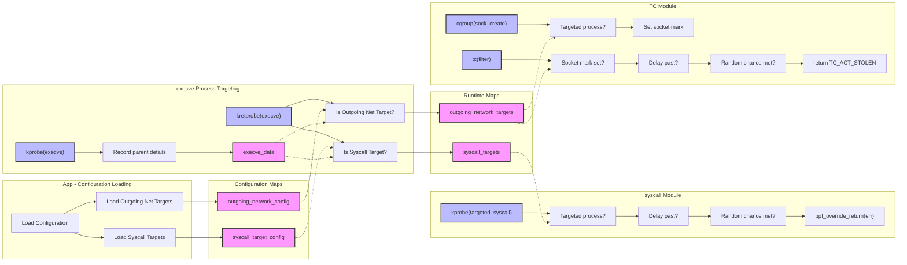

# Minderbinder

[](https://github.com/scottgerring/minderbinder/actions/workflows/ci.yaml)

_“Yossarian also thought Milo was a jerk; but he also know that Milo was a genius.”_

## What is this?
Minderbinder is a tool that uses eBPF to inject failures into running processes. 
Presently it can inject failures into **system calls** by attaching kprobes to the system call handler and failures into **outgoing network traffic** by attaching a traffic filter to Linux's traffic control subsystem. 

You can read a bit more about the motiviation and implementation details [in this blog entry](blog.scottgerring.com/introducing-minderbinder/ ). 

## What's it for?
Minderbinder aims to make it easy to generically inject failures into processes. At the moment you can write a config.yaml that describes the failures to inject and the processes to inject them into, start minderbinder, and see what happens. 

<details>
<summary>Video demo</summary>
	
[demo](https://github.com/user-attachments/assets/73cc8c3e-c447-4e0f-95c4-2e15d3f5fe70)

</details>

## Running Minderbinder
Check out [config.yaml](config.yaml) for a complete example. Minderbinder supports two different interventions - `syscall` and `outgoing_network`:

```yaml
agents_of_chaos:
  syscall:  
    # Stop curl from using `openat`
    - name: break_curl_openat
      syscall: openat
      ret_code: -2 # NOENT / no such file or directory
      targets:
        - process_name: curl
      delay_ms: 100 # Milliseconds to wait after the process starts. For openat, this gives the process a chance to start properly.
      failure_rate: 100
  outgoing_network:
    - name: break_wget_network
      targets:
        - process_name: wget
      delay_ms: 100 # Milliseconds. In this case, 100ms should be enough to get a DNS request through for the endpoint, before breaking the actual transfer to the HTTP server
      failure_rate: 100      
```

To run minderbinder, you specify the configuration file, and if you are using `outgoing_network`, the interface to attach to:
 ```bash
sudo ./minderbinder --interface enp67s0 config.yaml
```

Note: The graphs that pop up show general system call behaviour across the monitored values, and don't directly reflect the
actions minderbinder is performing on the targeted processes.

## How's it work?

Here's a helpful diagram! At a high level, the flow is:

* The user-space app reads the configuration file, attaches necessary probes, and writes the configuration into `syscall_target_config` and `outgoing_network_config` eBPF maps
* The `execve` kprobes catch new processes launching. Upon finding processes that match targets in the `_config` maps, they add the PID data to the target configuration and update the corresponding `_target` map. For example, a matched element in `syscall_target_config` leads to a PID+target configuration being added to `syscall_targets`
* The eBPF responsible for each module then fires for its particular hooks, and upon finding a relevant entry in its `_targets` map, and "breaks" the operation being considered accordingly




## Big Picture

The long-term goal is to provide a back-end for existing unit test frameworks, so that we can write component tests that can trivially break the code under test in interesting, chaos-related fashions. This might look something like this:

```go
func TestYourAPIHandler_DownstreamFailure(t *testing.T) {
	// Create a new request
	req := httptest.NewRequest(http.MethodGet, "/your-api-endpoint", nil)

	// Record the response
	rec := httptest.NewRecorder()

	// Failure configuration
	cfg := FailureConfig{
		OutgoingNetwork: [] OutgoingNetworkFailure {
            {
                Protocol: "TCP",
                DestPort: 443,
                FailureRate: 100
            }
        }
	}

	// Wrap the actual handler call with Minderbinder. Because Minderbinder is injecting
    // failures into this process using eBPF, we don't need to elaborately craft stubs here;
    // we can setup the 
    minderbinder := &Minderbinder{}
	minderbinder.WithFailures(cfg, func() (*http.Response, error) {
		// Call the API handler
		YourAPIHandler(rec, req)
		return nil
	})

	// We should get a 502 / bad gateway back
	assert.Equal(t, http.StatusBadGateway, rec.Code)
	assert.Equal(t, "Downstream service failed\n", rec.Body.String())
}

```

This gives us a mechanism to test our application and services resiliance in the face of failures. Traditionally we would do this either by extensively stubbing _all_ the interesting interfaces around the application and injecting failures, or, using some chaos engineering tool to inject failures into the entire aggregate system in a deployed cloud environment. Because Minderbinder leverages eBPF for the failure injection, the code needed for each supported language would be straightforward, as it would simply have to configure the native minderbinder component.

